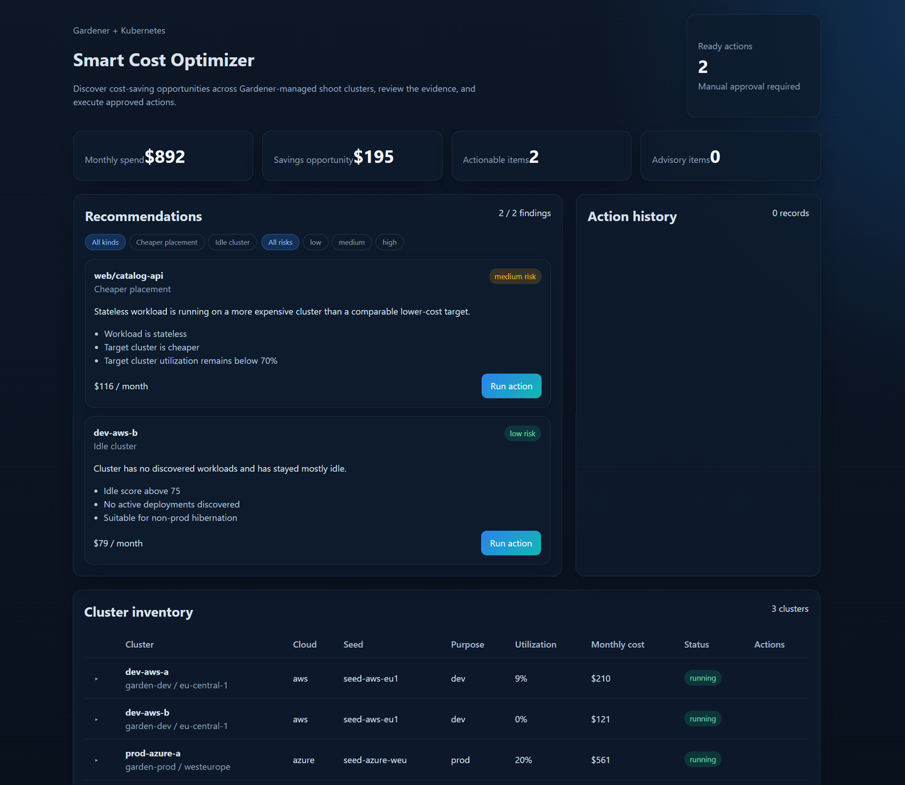
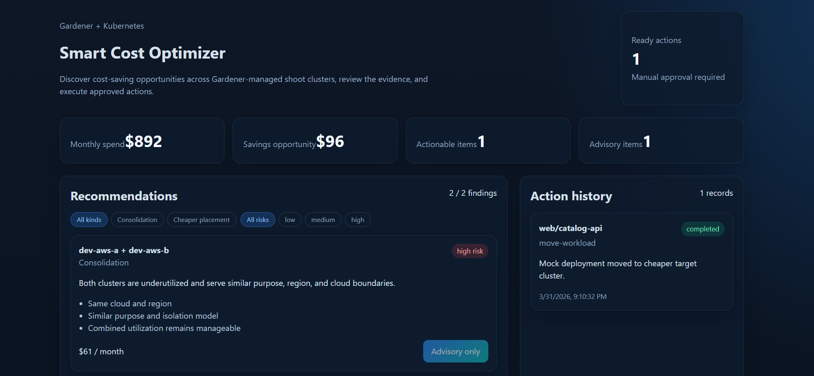

# Smart Cost Optimizer

Smart Cost Optimizer is a platform layer built on top of [Gardener](https://github.com/gardener/gardener) that adds a cost intelligence engine above the cluster lifecycle.

Gardener is an execution platform: it provisions, manages, and hibernates Kubernetes clusters across AWS, Azure, GCP, and other providers. What it does not include is an optimization brain — no underutilization detection, no savings estimation, no cross-cluster recommendations. That is what this project adds.

## What This Project Adds on Top of Gardener

| Capability | Gardener | This Project |
|---|---|---|
| Cluster lifecycle (create, upgrade, delete) | yes | uses Gardener |
| Cluster hibernation execution | yes | uses Gardener |
| APIs for cluster control | yes | uses Gardener |
| Underutilization detection | no | added here |
| Savings estimation | no | added here |
| Optimization recommendations | no | added here |
| Cross-cluster workload move | no | added here |
| Consolidation analysis | no | added here |
| Operator dashboard | no | added here |

The system produces actionable recommendations and lets operators execute cost-saving decisions through a REST API and React dashboard.

## UI Preview

Recommendations view with savings summary and cluster inventory:



After executing a hibernation action, the dashboard updates the savings summary, reduces the ready action count, and records the completed change in action history:



## Quick Start

The fastest way to run the full stack locally is Docker Compose, which requires no local Go or Node installation:

```bash
docker compose up --build
```

After startup:

- frontend: `http://localhost:5173`
- backend API: `http://localhost:8080/api/v1/recommendations`
- backend health: `http://localhost:8080/healthz`

The default Docker mode uses `DATA_SOURCE=mock`, which runs a built-in simulated landscape — no Gardener required.

For other startup options (shell script, PowerShell, Makefile) and for connecting to a real Gardener environment, see [USAGE.md](./USAGE.md).

## Data Source Modes

The backend supports three modes via the `DATA_SOURCE` environment variable:

- `mock` — built-in in-memory landscape; ideal for demos and development
- `real` — requires a real Gardener landscape and kubeconfig
- `auto` — tries real first, falls back to mock if unavailable

## API Surface

```
GET  /api/v1/clusters
GET  /api/v1/clusters/:name
GET  /api/v1/recommendations
GET  /api/v1/recommendations/:id
GET  /api/v1/actions
GET  /api/v1/savings/summary
POST /api/v1/actions/hibernate-cluster
POST /api/v1/actions/wake-cluster
POST /api/v1/actions/scale-nodepool
POST /api/v1/actions/move-workload
GET  /healthz
```

Full API contract: `backend/openapi/openapi.yaml`

## Configuration

Key backend environment variables:

| Variable | Default | Description |
|---|---|---|
| `DATA_SOURCE` | `mock` | `mock`, `real`, or `auto` |
| `API_ADDR` | `:8080` | backend listen address |
| `GARDENER_KUBECONFIG` | — | path to Garden cluster kubeconfig |
| `GARDENER_CONTEXT` | — | optional kubeconfig context |
| `SHOOT_KUBECONFIG_MAP` | — | comma-separated `name=path` pairs for shoot access |
| `PROMETHEUS_URL` | — | optional metrics endpoint |
| `FRONTEND_ORIGIN` | — | CORS origin for the dashboard |
| `REFRESH_INTERVAL_SECONDS` | `60` | recommendation refresh interval |
| `IDLE_THRESHOLD` | `75` | idle score threshold (0–100) for idle-cluster recommendations |
| `TARGET_UTILIZATION` | `0.7` | maximum target cluster utilization for placement decisions |
| `ACTION_LOG_PATH` | `./data/actions.jsonl` | persistent action history file |

## Documentation

| File | Purpose |
|---|---|
| [USAGE.md](./USAGE.md) | Installation, startup, UI walkthrough, API examples, demo script |
| [DOCKER.md](./DOCKER.md) | Docker Compose setup, container details, real-mode overrides |
| [FEATURES.md](./FEATURES.md) | Full feature list for current release and known limits |
| [PROJECT.md](./PROJECT.md) | Architecture, design decisions, tech stack rationale |
| [STRUCTURE.md](./STRUCTURE.md) | Project folder map, component connections, data flow |
